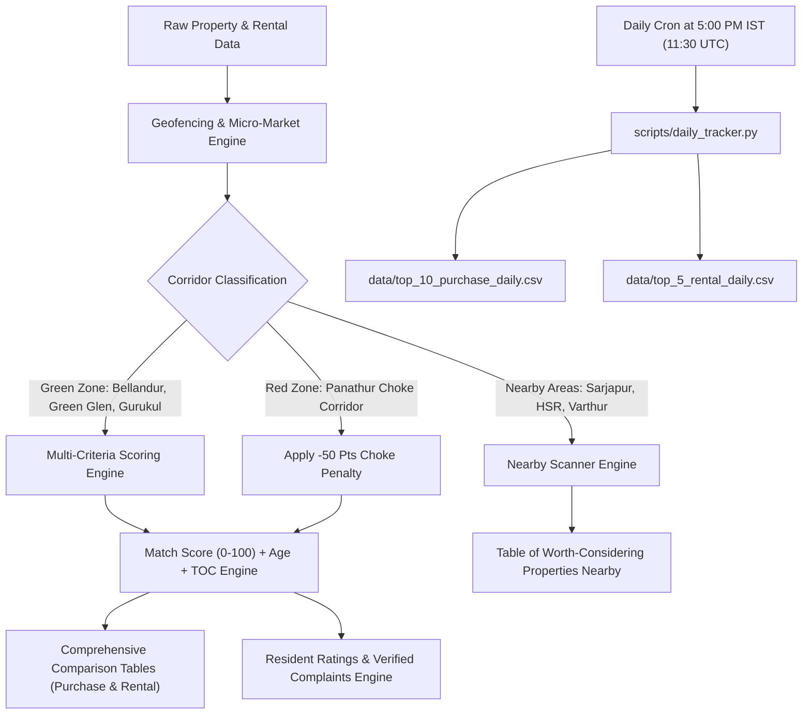

# 🧭 South East Bengaluru Real Estate Radar & Rental Discovery Platform

[](https://share.streamlit.io)
[](https://github.com/purntripathi-cmd/South-east-bengaluru-real-estate-radar/actions/workflows/daily_tracker.yml)
[](https://www.python.org/downloads/)
[](https://opensource.org/licenses/MIT)

> **Precision Real Estate & Rental Intelligence System** for the East Bengaluru Outer Ring Road (ORR) corridor: **Bellandur Core**, **Green Glen Layout**, and **Kadubeesanahalli strictly up to New Horizon Gurukul** + **Adjacent Worth-Considering Micro-Markets** (Sarjapur Road, HSR Layout, Marathahalli, Varthur/Gunjur). Enforces algorithmic traffic geofencing, filters chronic bottlenecks (Panathur), scores builder pedigree, displays resident ratings & verified complaints, computes Total Cost of Ownership (TOC) & upfront down payments, and records daily Top 10 Purchase & Top 5 Rental CSVs at **5:00 PM IST**.

---

## 📑 Table of Contents
1. [Executive Summary & Architecture](#1-executive-summary--architecture)
2. [Comprehensive Comparison Tables (Purchase & Rental)](#2-comprehensive-comparison-tables-purchase--rental)
3. [Resident Ratings, Feedback Scores & Verified Common Complaints](#3-resident-ratings-feedback-scores--verified-common-complaints)
4. [Nearby Areas Scanner: Worth-Considering Properties](#4-nearby-areas-scanner-worth-considering-properties)
5. [Micro-Market Zoning & Traffic Rules](#5-micro-market-zoning--traffic-rules)
6. [Financial Engine: Total Maintenance, Advance Cash & Total Ownership Cost (TOC)](#6-financial-engine-total-maintenance-advance-cash--total-ownership-cost-toc)
7. [Interactive Map UI & Google Maps Integration](#7-interactive-map-ui--google-maps-integration)
8. [Mobile-First Responsive Design](#8-mobile-first-responsive-design)
9. [Automated 5:00 PM IST Daily Tracker](#9-automated-500-pm-ist-daily-tracker)
10. [Local Quickstart & Streamlit Cloud Deployment](#10-local-quickstart--streamlit-cloud-deployment)

---

## 1. Executive Summary & Architecture

The application provides an institutional-grade decision matrix for property purchase and rental in Bengaluru's primary tech corridor (Outer Ring Road).



---

## 2. Comprehensive Comparison Tables (Purchase & Rental)

### 🏢 Purchase Comparison Table
Interactive, sortable, and exportable table comparing all purchase properties across all applicable dimensions:
* **Identification**: Property Name, Builder, Builder Tier, Micro-Market, Land Title, RERA Status.
* **Pricing & Configuration**: Rate per sqft (₹), Config (BHK), Carpet/Super Area (sqft), Base Agreement Value (₹ Cr).
* **Maintenance & Ownership**: Monthly Maintenance, Annual Maintenance, 20% Loan Down Payment, Upfront Cash Required (₹ Lakhs), Grand Total Ownership Cost (₹ Cr).
* **Location & Infrastructure**: Metro Blue Line Distance (km), PTP / Ecospace Distance (km), Route Status (Panathur-Free vs Red Choke).
* **Resident Sentiment**: Resident Rating (★ / 5.0), Feedback Score (/100), Common Complaints & Warnings.
* **Interactive Head-to-Head Comparator**: Select 2–4 properties to view a side-by-side spec-by-spec comparison matrix.

### 🏡 Rental Comparison Table
* **Parameters**: Society Name, Unit Title, Micro-Market, BHK, Area, Property Age, Monthly Rent, Monthly Maintenance, **Total Monthly Outflow (Rent + Maint)**, Security Deposit, Brokerage Savings, Platform Pricing Arbitrage, Safe Route Status, Resident Rating, Feedback Score, Verified Tenant Complaints, Direct Owner WhatsApp Links.
* **Interactive Head-to-Head Comparator**: Select 2–3 rental societies to compare monthly outflow, security deposit, and commute times.

---

## 3. Resident Ratings, Feedback Scores & Verified Common Complaints

Every property card and table incorporates granular resident feedback:
* **Resident Rating**: 1.0 to 5.0 Star scale with category breakdown:
  * Construction Quality & Structural Longevity
  * Maintenance & Clubhouse Amenities
  * Location, Arterial Connectivity & Metro Access
  * Water Security & Utility Continuity
* **Verified Common Complaints & Resident Warnings**:
  * Real resident feedback highlighting evening access queues, visitor parking rules, high maintenance charges, tanker dependencies, and monsoon water-logging vulnerabilities.

---

## 4. Nearby Areas Scanner: Worth-Considering Properties

Beyond the core radar (Bellandur, Green Glen, Gurukul), the system scans immediately adjacent micro-markets that provide compelling alternatives:

| Property Name | Micro-Market | Dist. to Bellandur | Rate / sqft | Base Price | Upfront Cash | Resident Rating | Key Value Proposition (Pros) | Real Resident Trade-offs (Cons) |
|---|---|---|---|---|---|---|---|---|
| **Godrej Lake Gardens** | Sarjapur Road (Kaikondrahalli) | 3.8 km | ₹11,800 | ₹2.10 Cr | ₹58 L | ⭐ 4.5 / 5 | Kaikondrahalli Lake frontage, Tier 1 Godrej build, 20% cheaper than Bellandur Core | Carmelaram signal bottleneck; extra 15 min commute |
| **Brigade Cornerstone Utopia** | Varthur - Gunjur Corridor | 6.2 km | ₹9,800 | ₹1.62 Cr | ₹45 L | ⭐ 4.6 / 5 | 47-acre smart township with high-street retail, cineplex, school inside campus | Varthur road widening incomplete; school hours traffic |
| **Purva Fairmont** | HSR Layout Sector 2 | 3.2 km | ₹15,800 | ₹2.92 Cr | ₹81 L | ⭐ 4.6 / 5 | Elite planned sector, 80ft tree-lined avenues, top restaurants, zero industrial dust | Higher price point; Agara junction peak morning signal |
| **Purva Riviera** | Marathahalli - ORR North | 4.5 km | ₹11,200 | ₹2.13 Cr | ₹59 L | ⭐ 4.3 / 5 | Direct ORR frontage, massive open grounds, walking distance to retail and multiplexes | 11-year old building; traffic noise and dust from flyover |
| **SJR Palazza City** | Harlur Road (Off Sarjapur) | 3.6 km | ₹10,400 | ₹1.48 Cr | ₹41 L | ⭐ 4.2 / 5 | High-rise close to HSR with entry ticket < ₹1.5 Cr for 2.5 BHK | Narrow Harlur main road; tanker dependency in summer |
| **Prestige Lakeside Habitat** | Varthur Lake Front | 7.1 km | ₹10,900 | ₹2.05 Cr | ₹57 L | ⭐ 4.6 / 5 | 102-acre Disney themed township, 4 mega clubhouses, high resale liquidity | Lake rejuvenation odor during windy evenings; 7 km from tech parks |

*All nearby properties are also plotted on the interactive map as distinct purple pins!*

---

## 5. Micro-Market Zoning, Dynamic Custom Pinning & Traffic Rules

* **🟢 Allowed Green Zones**: Bellandur Core, Green Glen Layout, Kadubeesanahalli strictly to the NCC Nagarjuna Green Woods side up to New Horizon Gurukul.
* **🔴 Blacklisted Red Zones**: Panathur Main Road, Panathur Railway Underpass, Panathur Post Office junction (-50 pts penalty).
* **🛠️ Custom Area Mode & Dynamic Pin Manager**:
  * Users can override or extend default corridor boundaries to inspect **any vicinity across Bengaluru**.
  * **🟢 Green Pins**: Define custom target check vicinities (with customizable coverage radius, e.g., 1,200m).
  * **🔴 Red Pins**: Define custom choke points or blacklist vicinities (with customizable radius and penalty points, e.g., Silk Board, Carmelaram, Panathur).
  * **Tap-to-Pin on Map**: Tap anywhere on the interactive Folium/Google Maps layer and click `[🟢 Pin as Green Target]` or `[🔴 Pin as Red Choke]` for instant geofenced re-scoring!

---

## 6. Financial Engine: Total Maintenance, Advance Cash, TOC & Rental Deposit Opportunity Cost

* **Rental Total Monthly Outflow with Security Deposit Opportunity Cost (7.5% p.a.)**:
  * In Bengaluru, landlords lock between 3 to 6 months of rent as interest-free security deposit.
  * The system computes the **opportunity cost of locked capital** at **7.5% annual interest** (equivalent to senior/standard fixed deposit or liquid fund returns):
    $$\text{Monthly Deposit Cost} = \frac{\text{Security Deposit (₹)} \times 7.5\%}{12}$$
  * Formatted and displayed separately across rental cards, comparison tables, and daily CSV snapshots:
    $$\textbf{Total Monthly: ₹73,500 (+1,700/- pm due to deposit)}$$
  * **Effective Monthly Cost**:
    $$\text{Effective Monthly Outflow} = \text{Base Rent} + \text{Monthly Maintenance} + \text{Monthly Deposit Opportunity Cost}$$

* **Total Maintenance Outflow (Purchase)**:
  * Purchase: Monthly maintenance (₹4.5/sqft/mo) & Annual maintenance.

* **Upfront Advance Required (Purchase)**:
  $$\text{Upfront Cash} = 20\%\text{ Down Payment} + \text{Stamp Duty (5.6\%)} + \text{Registration (1.0\%)} + \text{Legal \& Khata Fees} + \text{Corpus Fund}$$

* **Grand Total Ownership Cost (TOC)**:
  $$\text{TOC} = \text{Base Price} + 6.6\%\text{ Govt Taxes} + \text{Legal/Khata} + \text{Corpus} + \text{Interiors (₹15L–₹35L)} + \text{1st Year Maintenance}$$

---

## 7. Interactive Map UI, Google Maps & Direct Validation Links

* **Native Google Maps Tile Layers (Zero API Key Needed)**:
  * Google Maps (Roadmap) [Default]
  * Google Maps (Satellite / Hybrid)
  * Google Maps (Terrain)
  * OpenStreetMap & CartoDB Positron
* **1-Click Google Maps Direct Deep Links**:
  Every property card includes a **"📍 Open Exact Pin in Google Maps ↗"** button that opens directly in your Google Maps mobile app with coordinates.
* **Direct Post Validation & RERA Verification Links**:
  * **Purchase Units**: Direct buttons for `[🔗 Verify Official Post / Site ↗]` and `[📋 Karnataka RERA Portal ↗]` linking directly to official Karnataka RERA project filings.
  * **Rental Units**: Direct buttons for `[🔗 Verify Post / Listing ↗]` and `[💬 Community Listing ↗]`.
* **Optional Google Cloud API Key**: Supported via sidebar.

---

## 8. Mobile-First Responsive Design & Unattended Daily Auto-Refresh

* Custom CSS media queries (`@media (max-width: 768px)`) ensure seamless viewing on smartphones and tablets.
* Touch targets $\ge 44\text{px}$, responsive map height (380px on mobile), and auto-stacking comparison cards.
* **Autonomous 24-Hour Page Auto-Refresh**: Embedded client-side script checks for calendar day rollover every 45s and automatically reloads to fetch fresh scheduled data even if the dashboard is left open unattended on a screen or mobile browser.

---

## 9. Automated 5:00 PM IST Daily Tracker & Delta Validation Engine

* **Scheduled Time**: Every day at **5:00 PM IST (11:30 UTC)** via GitHub Actions (`cron: '30 11 * * *'`).
* **Records ALL Available Options**:
  * `data/all_purchase_properties_daily.csv`: Full daily snapshot of **all** available purchase properties.
  * `data/all_rental_properties_daily.csv`: Full daily snapshot of **all** available rental properties.
  * `data/top_10_purchase_daily.csv`: Top 10 purchase properties scored by radar.
  * `data/top_5_rental_daily.csv`: Top 5 rental properties scored by radar.
* **Parameter Delta Validation Engine**:
  * Compares live parameters against `data/property_audit_ledger.json`.
  * **Zero Duplicate Redundant Writes**: If today's files exist and no parameters changed, it logs `VALIDATED_NO_CHANGES` and skips writing.
  * **Change Logging**: If rates, maintenance, ratings, or bottlenecks change, it automatically logs changes to `data/property_parameter_changes.csv` and updates daily snapshots.
* **Manual Snapshot Trigger (Tab 6)**: 1-click execution button with live visual audit feedback.

---

## 10. Local Quickstart & Streamlit Cloud Deployment

### 💻 Local Run
```bash
git clone https://github.com/purntripathi-cmd/South-east-bengaluru-real-estate-radar.git
cd South-east-bengaluru-real-estate-radar
pip install -r requirements.txt
streamlit run app.py
```

### ⚡ Manual Snapshot Trigger
```bash
python scripts/daily_tracker.py --force
```

### ☁️ Streamlit Cloud Deployment
1. Log in to [share.streamlit.io](https://share.streamlit.io).
2. Connect repository `purntripathi-cmd/South-east-bengaluru-real-estate-radar`.
3. Set main file path to `app.py` and click **Deploy**!
