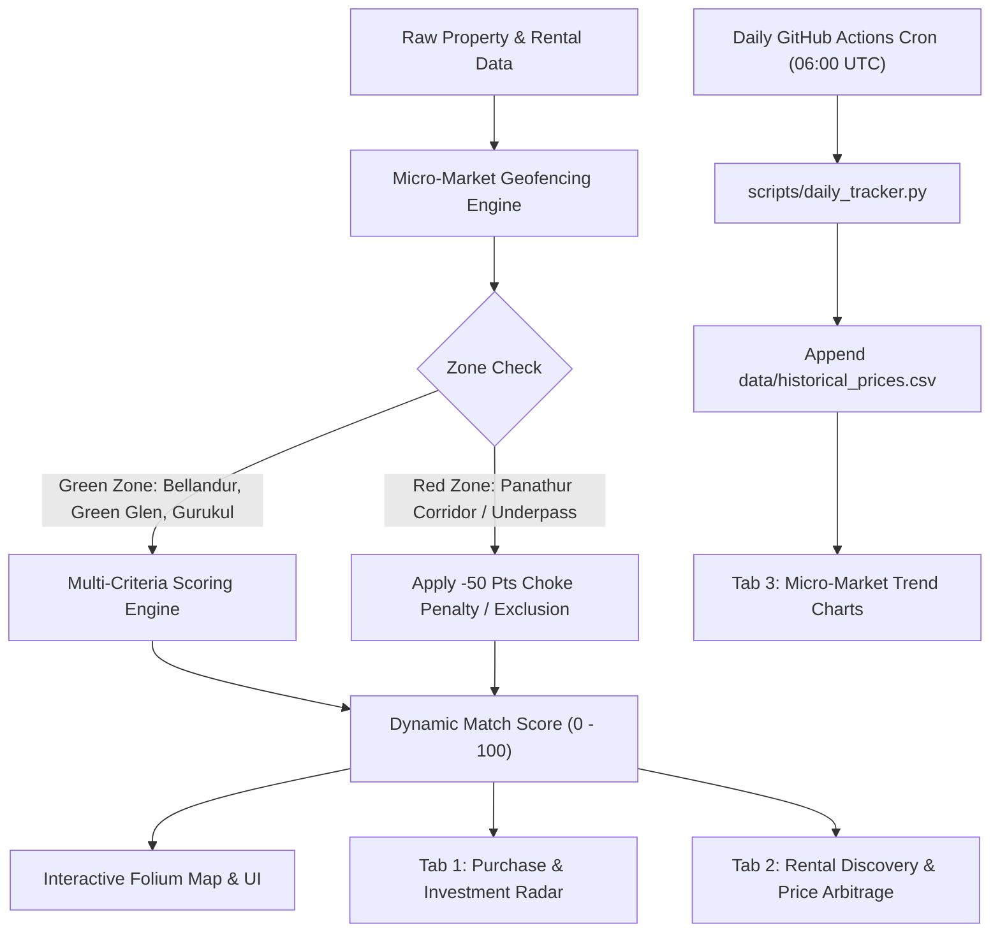

# 🧭 East Bengaluru Real Estate Radar & Rental Discovery Platform

[](https://share.streamlit.io)
[](https://github.com/purntripathi-cmd/South-east-bengaluru-real-estate-radar/actions/workflows/daily_tracker.yml)
[](https://www.python.org/downloads/)
[](https://opensource.org/licenses/MIT)

> **Precision Real Estate & Rental Intelligence System** for the East Bengaluru Outer Ring Road (ORR) corridor: **Bellandur Core**, **Green Glen Layout**, and **Kadubeesanahalli strictly up to New Horizon Gurukul**. Enforces algorithmic traffic geofencing, filters out chronic bottlenecks (Panathur), scores builder pedigree, tracks multi-year capital appreciation, and delivers direct-from-owner rental discovery with multi-platform price arbitrage.

---

## 📑 Table of Contents
1. [Executive Summary & Project Architecture](#1-executive-summary--project-architecture)
2. [Micro-Market Zoning & Traffic Constraint Rules](#2-micro-market-zoning--traffic-constraint-rules)
3. [Core Parameter Matrix & Weighted Scoring Engine](#3-core-parameter-matrix--weighted-scoring-engine)
4. [Builder Pedigree Hierarchy](#4-builder-pedigree-hierarchy)
5. [Quality & Land Title Verification Checklist (4 Pillars)](#5-quality--land-title-verification-checklist-4-pillars)
6. [Interactive Map UI & Geofencing Specification](#6-interactive-map-ui--geofencing-specification)
7. [Rental House Discovery Radar (Tab 2)](#7-rental-house-discovery-radar-tab-2)
8. [Automated Daily Tracker Architecture (GitHub Actions)](#8-automated-daily-tracker-architecture-github-actions)
9. [Repository Structure](#9-repository-structure)
10. [Local Quickstart & Streamlit Cloud Deployment](#10-local-quickstart--streamlit-cloud-deployment)

---

## 1. Executive Summary & Project Architecture

The **East Bengaluru Real Estate Radar** is a production-grade Streamlit application engineered to eliminate emotion and speculation from home acquisition and renting in Bengaluru's primary tech corridor (ORR).



---

## 2. Micro-Market Zoning & Traffic Constraint Rules

The application enforces strict geographic zoning boundaries to eliminate properties trapped behind chronic congestion bottlenecks:

### 🟢 Allowed 'Green' Zones
* **Bellandur Core Grid**: Established residential core with wide 60ft/40ft egress corridors onto the Outer Ring Road. High rental velocity and walking access to the upcoming Blue Line Metro station.
* **Green Glen Layout**: Highly structured, tree-lined internal grid layout. Features multiple ingress/egress routes to ORR, walking distance to RMZ Ecospace, and high elevation ridge safety.
* **Kadubeesanahalli (Gurukul Corridor)**: Strictly bounded to the **NCC Nagarjuna Green Woods side up to New Horizon Gurukul**. Directly accessible from the ORR service road without entering Panathur Road.

### 🔴 Strictly Blacklisted 'Red' Zones
* **Panathur Main Road Choke Corridor**: Unregulated narrow 20ft road carrying 50x designed density.
* **Panathur Railway Underpass & S-Curve**: Chronic single-lane bottleneck subject to extreme monsoon flooding and 45–75 minute delays for a 2km stretch.
* **Panathur Post Office Junction**: Commercial choke point with no bypass options.
* **Penalty Enforcement**: Any property whose daily transit routes through these choke points triggers an **instant -50 points penalty** or automated disqualification.

---

## 3. Core Parameter Matrix & Weighted Scoring Engine

The engine computes a dynamic **Match Score ($0 - 100$)** using a weighted sum formula:

$$\text{Match Score} = \max\left(0, \min\left(100, \sum_{i=1}^{7} w_i \cdot s_i + \text{Penalties}\right)\right)$$

| Parameter Category | Focus & Metric | Scoring Logic | Default Weight |
|---|---|---|---|
| **Metro Proximity** | Distance to Bellandur / Kadubeesanahalli Blue Line Metro | $< 1\text{ km} = 100\%$, $1-2\text{ km} = 75\%$, $2-3\text{ km} = 50\%$, $> 3\text{ km} = 30\%$ | **15%** |
| **Traffic & Route Integrity** | Absence of bottlenecks (Zero Panathur dependency) | Zero Panathur route = $100\%$. Panathur route = **-50 pts penalty** | **20%** |
| **Exact Distances** | Travel time & distance to Office, School, Airport, Hospitals, Malls | Congestion-weighted decay curve across anchors | **15%** |
| **Builder Pedigree** | Developer classification & institutional liquidity | Tier 1 Top 10 = $100\%$, Tier 2 = $80\%$, Local = $20\%$ | **15%** |
| **Water Logging & Drainage** | Elevation (MASL), lake buffer elevation, storm drains | Elevation bonus ($\ge 895\text{m}$), French drain infrastructure | **10%** |
| **Financials & Appreciation** | Price/sqft, historical YoY appreciation trend, rental yield | $> 12\%$ YoY growth = $100\%$, Yield ($3.5\% - 4.5\%$) | **15%** |
| **Land Title & Gated Tech** | Legal title compliance & construction technology | A-Khata BBMP ($50\text{ pts}$), RERA ($30\text{ pts}$), Mivan Formwork ($20\text{ pts}$) | **10%** |

---

## 4. Builder Pedigree Hierarchy

Properties are evaluated against a rigorous developer hierarchy to protect capital appreciation and structural longevity:

### 🏆 Primary Choices (Top 10 Tier 1 Developers)
1. **Sobha Limited** — German precision engineering, in-house precast factory, flawless title history.
2. **Prestige Group** — Largest listed developer in South India, institutional asset maintenance.
3. **Brigade Group** — World Trade Center & Orion Mall developer, punctual project completion.
4. **Total Environment Building Systems** — Bespoke craftsmanship, earth-sheltered green roofs, terracotta brick.
5. **Godrej Properties** — Transparent governance, publicly listed, strict RERA escrow discipline.
6. **Embassy Group** — Institutional commercial & residential powerhouse, Embassy REIT sponsor.
7. **Puravankara Limited** — 45+ years track record, world-class precast engineering.
8. **Assetz Property Group** — Contemporary architectural design, Singaporean equity backing, high green cover.
9. **Century Real Estate** — Substantial land bank owner, master-planned residential enclaves.
10. **Salarpuria Sattva Group** — Premier ORR commercial park and residential developer.

### 🥈 Secondary Choices (Tier 2 Renowned Developers)
* **Sumadhura Infracon**
* **Rohan Builders** (Famous for *Plus Home* zero common walls in Green Glen Layout)
* **Arvind SmartSpaces** (Lalbhai Group)
* **Vajram Group**
* **Shriram Properties**
* **NCC Urban** (e.g., Nagarjuna Green Woods)

---

## 5. Quality & Land Title Verification Checklist (4 Pillars)

Every property undergoes a 4-pillar verification audit before shortlisting:

1. **A-Khata & Legal Title**: Must hold verified BBMP/BDA A-Khata. Transitional B-Khata and panchayat approvals are strictly flagged as high legal risks.
2. **Karnataka RERA Compliance**: Verification on [rera.karnataka.gov.in](https://rera.karnataka.gov.in) for active registration, litigation history, and delay records.
3. **Dual Water Source Assurance**: Active BWSSB Cauvery piped water supply + licensed high-yield borewells + dual-piping Sewage Treatment Plant (STP).
4. **Rajakaluve Setback Safety**: Strict verification confirming zero infringement on 30m primary or 15m secondary storm-water drain buffers.

---

## 6. Interactive Map UI & Geofencing Specification

The UI features an interactive **Folium (`streamlit-folium`)** mapping component:
* **Visual Zoning Boundaries**: Allowed Green Zones (Bellandur Core, Green Glen, Kadubeesanahalli Gurukul) rendered in translucent green; Blacklisted Red Zones (Panathur choke points) rendered with high-contrast red warning polygons.
* **Metro Alignment Polyline**: Full ORR Blue Line Phase 2A route from Silk Board to KR Puram with station markers.
* **Dynamic Location Pins**: Click anywhere on the map to dynamically reposition your search center coordinates.
* **Property Markers**: Color-coded pins with rich HTML cards showing price/sqft, builder tier, match score, and direct route status.
* **Preference Persistence**: Configured weights and coordinates persist across sessions in `data/user_preferences.json`.

---

## 7. Rental House Discovery Radar (Tab 2)

Specially designed for tech executives and families seeking quality rental homes in the Bellandur / Green Glen / Kadubeesanahalli corridor:

* **Vicinity Filtering**: Instant filtering for Bellandur Core, Green Glen Layout, and Kadubeesanahalli (Gurukul side).
* **Multi-Platform Price Comparison**: Side-by-side pricing listed across **NoBroker**, **99acres**, **MagicBricks**, **Housing.com**, and **Direct Owner**.
* **Zero-Brokerage Deal Finder**: Highlights Direct-from-Owner listings, showing potential brokerage savings of **₹50,000 to ₹1,45,000**.
* **Direct 1-Click WhatsApp Contact**: Click to open a direct WhatsApp chat (`https://wa.me/...`) with a pre-formatted message referencing the unit name and configuration.
* **Bottleneck Alert**: Direct warning if the rental requires navigating the Panathur underpass.
* **Micro-Market Fair Rent Calculator**: Computes fair market rent and estimated landlord yield based on area and furnishing.
* **Interactive Site Visit Scheduler**: Schedule and track property inspection reminders within the application.

---

## 8. Automated Daily Tracker Architecture (GitHub Actions)

An automated cron workflow runs daily to track price movements and appreciation:

* **Workflow**: `.github/workflows/daily_tracker.yml`
* **Cron Schedule**: `0 6 * * *` (Daily at 06:00 UTC / 11:30 AM IST)
* **Script**: `scripts/daily_tracker.py`
* **Storage**: Appends daily market snapshots and spread analysis to `data/historical_prices.csv` and logs to `data/daily_tracker_log.json`.
* **Zero Manual Effort**: Git commits and pushes updates automatically.

---

## 9. Repository Structure

```
South-east-bengaluru-real-estate-radar/
├── .github/
│   └── workflows/
│       └── daily_tracker.yml        # Scheduled GitHub Actions cron workflow
├── .streamlit/
│   └── config.toml                  # Streamlit dark theme & layout configuration
├── data/
│   ├── anchors.json                 # Tech parks, schools, hospitals, metro stations
│   ├── daily_tracker_log.json       # Execution log of latest daily tracker run
│   ├── historical_prices.csv        # 2020-2026 quarterly micro-market price dataset
│   ├── market_zones.json            # Geofencing polygons for Green and Red zones
│   ├── properties.json              # Curated purchase property inventory
│   ├── rental_properties.json       # Rental units with multi-platform price listings
│   └── user_preferences.json        # Persistent scoring weights & search parameters
├── scripts/
│   └── daily_tracker.py             # Autonomous daily scraper & snapshot generator
├── utils/
│   ├── geo.py                       # Haversine distance & polygon containment
│   ├── scoring.py                   # 7-factor weighted scoring algorithm & penalties
│   └── storage.py                   # Data persistence & retrieval helpers
├── app.py                           # Main production Streamlit web application
├── requirements.txt                 # Application dependencies
└── README.md                        # Documentation & technical blueprint
```

---

## 10. Local Quickstart & Streamlit Cloud Deployment

### 💻 Local Installation

1. **Clone the repository:**
   ```bash
   git clone https://github.com/purntripathi-cmd/South-east-bengaluru-real-estate-radar.git
   cd South-east-bengaluru-real-estate-radar
   ```

2. **Create a virtual environment & install dependencies:**
   ```bash
   python -m venv venv
   source venv/bin/activate  # On Windows: .\venv\Scripts\activate
   pip install -r requirements.txt
   ```

3. **Run the Streamlit application:**
   ```bash
   streamlit run app.py
   ```
   Open your browser at `http://localhost:8501`.

4. **Test the Daily Tracker script:**
   ```bash
   python scripts/daily_tracker.py --dry-run
   ```

---

### ☁️ Streamlit Cloud Deployment (1-Click)

1. Fork or push this repository to your GitHub account: `purntripathi-cmd/South-east-bengaluru-real-estate-radar`.
2. Visit **[share.streamlit.io](https://share.streamlit.io)** and log in with GitHub.
3. Click **"New app"**, select this repository, set Branch to `main`, and Main file path to `app.py`.
4. Click **"Deploy"**!
5. The scheduled GitHub Action will automatically keep your live deployed app updated with daily market rate snapshots!

---

**Developed with precision for East Bengaluru home buyers, investors, and tenants.**
