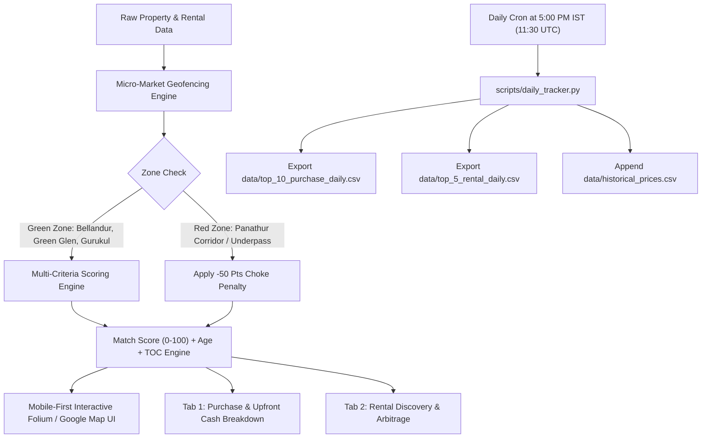

# 🧭 East Bengaluru Real Estate Radar & Rental Discovery Platform

[](https://share.streamlit.io)
[](https://github.com/purntripathi-cmd/South-east-bengaluru-real-estate-radar/actions/workflows/daily_tracker.yml)
[](https://www.python.org/downloads/)
[](https://opensource.org/licenses/MIT)

> **Precision Real Estate & Rental Intelligence System** for the East Bengaluru Outer Ring Road (ORR) corridor: **Bellandur Core**, **Green Glen Layout**, and **Kadubeesanahalli strictly up to New Horizon Gurukul**. Enforces algorithmic traffic geofencing, filters chronic bottlenecks (Panathur), scores builder pedigree, tracks multi-year capital appreciation, evaluates property age, computes Total Cost of Ownership (TOC) & upfront down payments, and records daily Top 10 Purchase & Top 5 Rental CSVs at **5:00 PM IST**.

---

## 📑 Table of Contents
1. [Executive Summary & Project Architecture](#1-executive-summary--project-architecture)
2. [Micro-Market Zoning & Traffic Constraint Rules](#2-micro-market-zoning--traffic-constraint-rules)
3. [Property Age & Structural Longevity Metrics](#3-property-age--structural-longevity-metrics)
4. [Financial Engine: Total Maintenance, Advance Cash & Total Ownership Cost (TOC)](#4-financial-engine-total-maintenance-advance-cash--total-ownership-cost-toc)
5. [Interactive Map UI & Google Maps Integration](#5-interactive-map-ui--google-maps-integration)
6. [Mobile-First Responsive Design](#6-mobile-first-responsive-design)
7. [Rental House Discovery Radar (Tab 2)](#7-rental-house-discovery-radar-tab-2)
8. [Automated Daily Tracker at 5:00 PM IST (Top 10 Purchase & Top 5 Rental CSVs)](#8-automated-daily-tracker-at-500-pm-ist)
9. [Builder Pedigree Hierarchy & Due Diligence Checklist](#9-builder-pedigree-hierarchy--due-diligence-checklist)
10. [Local Quickstart & Streamlit Cloud Deployment](#10-local-quickstart--streamlit-cloud-deployment)

---

## 1. Executive Summary & Project Architecture

The **East Bengaluru Real Estate Radar** is a production-grade Streamlit application engineered to eliminate emotion and speculation from home buying and renting in Bengaluru's primary tech corridor (Outer Ring Road).



---

## 2. Micro-Market Zoning & Traffic Constraint Rules

The application enforces strict geographic zoning boundaries to eliminate properties trapped behind chronic congestion bottlenecks:

### 🟢 Allowed 'Green' Zones
* **Bellandur Core Grid**: Wide arterial access onto Outer Ring Road, high rental velocity, walking access to upcoming Blue Line metro.
* **Green Glen Layout**: Highly structured internal grid layout, walking distance to RMZ Ecospace, elevated drainage ridge.
* **Kadubeesanahalli (Gurukul Side)**: Strictly bounded to the **NCC Nagarjuna Green Woods side up to New Horizon Gurukul**, directly accessible from ORR without crossing Panathur Road.

### 🔴 Strictly Blacklisted 'Red' Zones
* **Panathur Main Road Choke Corridor**: Unregulated narrow 20ft road carrying 50x designed density.
* **Panathur Railway Underpass & S-Curve**: Chronic single-lane bottleneck subject to extreme monsoon flooding and 45–75 minute delays for a 2km stretch.
* **Panathur Post Office Junction**: Commercial choke point with no bypass options.
* **Penalty Enforcement**: Any property routing through these choke points triggers an automatic **-50 points penalty** or disqualification.

---

## 3. Property Age & Structural Longevity Metrics

Both purchase and rental inventories feature prominent **Property Age Indicators**:
* **Age in Years**: Calculated dynamically against the year of construction (`year_built`).
* **Categorization**:
  * 🆕 **Brand New (0–3 Years)**: Highest energy efficiency, modern Mivan monolithic casting, zero maintenance backlog.
  * 💎 **Prime Modern (4–7 Years)**: Settled society governance, active Cauvery water connections, mature landscape.
  * 🏛️ **Mature Gated (8–12 Years)**: Established resident association, proven flood resistance during Bengaluru monsoons.
  * ⚠️ **Older (12+ Years)**: Potential plumbing and lift retrofitting requirements.
* **Interactive Filter**: Filter inventory by age category directly from the UI.

---

## 4. Financial Engine: Total Maintenance, Advance Cash & Total Ownership Cost (TOC)

Buying a property in Bengaluru involves significant legal, statutory, and society charges beyond the base agreement value. The application calculates the complete financial footprint:

### 1. Total Maintenance Outflow
* **Purchase**: Monthly maintenance per sqft (e.g. ₹4.5/sqft/mo $\times$ 1,950 sqft = **₹8,775/mo** $\rightarrow$ **₹1,05,300/year**).
* **Rental**: Monthly rent + monthly maintenance = **Total Monthly Outflow** (e.g. ₹68,000 rent + ₹5,500 maintenance = **₹73,500/mo**).

### 2. Upfront Advance & Down Payment Required
* **20% Home Loan Down Payment**: Paid in cash from personal funds.
* **Karnataka Stamp Duty (5.6%)**: Urban stamp duty (5.0%) + BBMP surcharge/cess (0.6%). Required 100% upfront before registration.
* **Government Registration Fee (1.0%)**: Required upfront in cash/bank transfer.
* **Legal Advocate Title Vetting & BBMP e-Aasthi Khata Transfer**: ~₹60,000.
* **Society Sinking / Corpus Fund**: ₹1.5 Lakhs – ₹3.5 Lakhs paid upfront to Association.
* **Total Upfront Cash Required**:
  $$\text{Upfront Cash} = 20\%\text{ Down Payment} + \text{Stamp Duty (5.6\%)} + \text{Registration (1.0\%)} + \text{Legal/Khata} + \text{Corpus Fund}$$

### 3. Grand Total Cost of Ownership (TOC)
$$\text{TOC} = \text{Base Price} + \text{Registration (6.6\%)} + \text{Legal \& Khata} + \text{Corpus Fund} + \text{Interiors (₹15L-₹35L)} + \text{1st Year Maintenance}$$

---

## 5. Interactive Map UI & Google Maps Integration

### ❓ Why was the map blank before?
1. Default Leaflet / CartoDB tiles (`cartocdn.com`) are frequently blocked by Indian ISP firewalls, enterprise VPNs, or browser adblockers (Brave Shields, uBlock Origin).
2. Fixed iframe pixel widths can collapse to 0px on certain mobile viewports.

### 💡 How Google Maps is Integrated:
1. **Google Maps Tile Layers (Zero API Key Required)**:
   The application now includes native Google Maps CDN tile layers:
   * **Google Maps (Roadmap)**: High-contrast arterial roads and landmark names.
   * **Google Maps (Satellite / Hybrid)**: High-resolution satellite imagery with overlaid street labels.
   * **Google Maps (Terrain)**: Topographical elevation and drainage slopes.
   These tiles load directly from Google's high-speed servers (`mt1.google.com`) without any API keys or quota limits!
2. **Optional Google Cloud API Key**:
   If you have a Google Cloud Maps API Key, you can input it in the sidebar for Google Places and Geocoding APIs.
3. **1-Click Google Maps Deep Links**:
   Every property and rental card includes a **"📍 Open Exact Pin in Google Maps ↗"** button that opens directly in your Google Maps mobile app with coordinates!

---

## 6. Mobile-First Responsive Design

* **Fluid Breakpoints**: Custom media queries (`@media (max-width: 768px)`) ensure seamless viewing on iPhones, Androids, and tablets.
* **Touch-Friendly Controls**: Large touch targets for buttons, sliders, and tabs.
* **Auto-Stacking Layout**: Multi-column data collapses into vertical cards without horizontal scrollbars.
* **Responsive Map Container**: Folium container scales to 380px on mobile screens with pan/zoom gestures enabled.

---

## 7. Rental House Discovery Radar (Tab 2)

* **Vicinity Filtering**: Search rentals strictly in **Bellandur Core**, **Green Glen Layout**, and **Kadubeesanahalli (Gurukul side)**.
* **Multi-Platform Price Comparison**: Side-by-side pricing listed across **NoBroker**, **99acres**, **MagicBricks**, **Housing.com**, and **Direct Owner**.
* **Zero-Brokerage Deal Finder**: Highlights Direct-from-Owner listings, showing potential brokerage savings of **₹52,000 to ₹1,45,000**.
* **Direct 1-Click WhatsApp Contact**: Click to launch a WhatsApp chat (`https://wa.me/...`) with a pre-filled inquiry referencing the unit and society name.
* **Total Monthly Outflow**: Displays rent + maintenance combined.

---

## 8. Automated Daily Tracker at 5:00 PM IST

The radar executes daily at **5:00 PM IST (11:30 UTC)**:
* **Workflow**: `.github/workflows/daily_tracker.yml` and `workflows/daily_tracker.yml`
* **Cron Expression**: `30 11 * * *`
* **Daily Exported CSVs**:
  * `data/top_10_purchase_daily.csv`: Top 10 purchase properties with Age, Rate/sqft, Upfront Advance, Total Ownership Cost, and Traffic Verdict.
  * `data/top_5_rental_daily.csv`: Top 5 rental properties with Age, Monthly Rent, Total Outflow, Brokerage Savings, and WhatsApp Contact Links.
  * `data/historical_prices.csv`: Multi-year price progression dataset.
* **Local Trigger**: Run `scripts/run_daily_5pm_ist.bat` on Windows or click **"Run 5:00 PM IST Snapshot Now"** in Tab 5.

---

## 9. Builder Pedigree Hierarchy & Due Diligence Checklist

### 🏆 Top 10 Tier 1 Developers
1. Sobha Limited | 2. Prestige Group | 3. Brigade Group | 4. Total Environment Building Systems | 5. Godrej Properties | 6. Embassy Group | 7. Puravankara Limited | 8. Assetz Property Group | 9. Century Real Estate | 10. Salarpuria Sattva Group

### 🥈 Secondary Choices (Tier 2)
Sumadhura Infracon, Rohan Builders, Arvind SmartSpaces, Vajram Group, Shriram Properties, NCC Urban.

### 📋 4 Mandatory Due Diligence Pillars
1. BBMP / BDA A-Khata Title Verification
2. Karnataka RERA active registration & litigation check
3. Dual Water Source (Cauvery connection + Borewells + STP)
4. Storm-Water Drain (Rajakaluve) Setback Buffer clearance (30m primary / 15m secondary)

---

## 10. Local Quickstart & Streamlit Cloud Deployment

### 💻 Local Run
```bash
git clone https://github.com/purntripathi-cmd/South-east-bengaluru-real-estate-radar.git
cd South-east-bengaluru-real-estate-radar
pip install -r requirements.txt
streamlit run app.py
```

### ⚡ Manual 5 PM IST Snapshot Trigger
```bash
python scripts/daily_tracker.py --force
```

### ☁️ Streamlit Cloud Deployment
1. Log in to [share.streamlit.io](https://share.streamlit.io).
2. Select `purntripathi-cmd/South-east-bengaluru-real-estate-radar`.
3. Set Main file path to `app.py` and click **Deploy**!

---

**Built with precision for East Bengaluru home buyers, investors, and tenants.**
